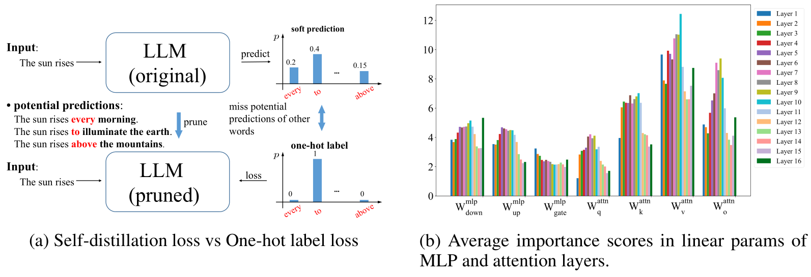

This repository is the official implementation of "SDMPrune: Self-Distillation MLP Pruning for Efficient Large Language Models".

[[Paper]()]    [[BibTex](#Citation)]    [[HuggingFace](https://huggingface.co/visresearch/SDMPrune/tree/main)]

## 1. Introduction

The gradient computation with one-hot labels ignore the potential predictions on other words, thus missing key information for generative capability of the original model. To address this issue, we introduce a self-distillation loss during the pruning phase (rather than post-training) to fully exploit the predictions of the original model, thereby obtaining more accurate gradient information for pruning. Moreover, we find that, compared to attention modules, the predictions of LLM are less sensitive to multilayer perceptron (MLP) modules, which take up more than 5× parameters (LLaMA3.2-1.2B). To this end, we focus on the pruning of MLP modules, to significantly compress LLM without obvious performance degradation. Experimental results on extensive zero-shot benchmarks demonstrate that our method significantly outperforms existing pruning methods.




## 2. Quick Start

### 2.1 Installation
```
conda create -n SDMPrune python=3.9
pip install -r requirement.txt
```

### 2.2 Prune LLMs

```
bash scripts/prune.sh
```
This script would compress the LLaMA3.2-1B model. You need to download [LLaMA3.2-1B](https://huggingface.co/meta-llama/Llama-3.2-1B) pretrained weights. The dataset would be automatically downloaded and sampled.


### 2.3 Train LLMs

```
bash scripts/run.sh
```
This script would compress the LLaMA3.2-1B model. You need to download [LLaMA3.2-1B](https://huggingface.co/meta-llama/Llama-3.2-1B) pretrained weights. The dataset would be automatically downloaded and sampled.


### 2.4 Evaluate results

```
bash scripts/eval_full.sh ckpt_path
bash scripts/eval_lora.sh ckpt_path adaptor_path
```


## 3. Main Results

+ **Zero-shot performance and Perplexity**

| Ratio | Method        |   PPL↓    |   ARCe    |   ARCc    |   BOOLQ   |   Crows   |   OBQA   |   PIQA    |   Race    |   SIQA    |  TQA  |   Wino    | Average↑  |
| :---: | :------------ | :-------: | :-------: | :-------: | :-------: | :-------: | :------: | :-------: | :-------: | :-------: | :---: | :-------: | :-------: |
|  0%   | LLaMA3.2-1.2B |   12.98   |   37.12   |   60.69   |   64.04   |   62.55   |   37.6   |   74.16   |   37.61   |   42.89   | 37.70 |   60.38   |   51.47   |
|  20%  | SDMPrune      |   26.96   | **31.14** | **55.22** | **67.58** |   57.84   |   32.4   | **70.29** | **35.41** | **42.73** | 40.20 |   56.59   | **48.94** |
|  30%  | SDMPrune      | **39.70** | **28.50** | **47.47** | **64.68** | **56.89** | **29.0** | **66.32** | **33.21** | **40.84** | 42.35 | **54.70** | **46.40** |
|  40%  | SDMPrune      |   70.12   | **26.02** |   42.63   | **65.38** |   52.59   |   25.6   | **63.44** | **32.25** | **38.74** | 43.30 | **52.17** | **44.21** |

+ **Comparison to other small-scale LLMs**

  | Model Name                     | #Params  | ARC-e    | ARC-c    | BOOLQ    | Crows    | OBQA     | PIQA     | Race     | SIQA     | TFIQA    | Wino     | Average  |
  | ------------------------------ | -------- | -------- | -------- | -------- | -------- | -------- | -------- | -------- | -------- | -------- | -------- | -------- |
  | ShearedLLaMA1.3B [44]          | 1.3B     | 29.1     | 54.4     | 62.0     | 63.7     | 34.4     | 73.4     | 36.3     | 41.3     | 36.8     | 58.1     | 49.0     |
  | TinyLLaMA1.1B [48]             | 1.1B     | 30.1     | 55.3     | 57.8     | 62.3     | 36.0     | 73.3     | 36.5     | 40.6     | 37.6     | 59.1     | 48.9     |
  | Pythia1.0B [4]                 | 1.1B     | 26.9     | 49.0     | 60.9     | 60.2     | 31.4     | 69.3     | 32.8     | 39.8     | **40.5** | 53.6     | 46.4     |
  | Falcon1.3B [1]                 | 1.3B     | 31.5     | 57.5     | 61.5     | 61.8     | 35.8     | 74.6     | 36.2     | 41.1     | 35.8     | 61.2     | 49.7     |
  | MobileLLM1.0B [22]             | 1.0B     | 33.5     | 58.5     | 65.6     | 60.4     | **36.6** | 73.6     | 34.6     | 41.3     | 38.3     | **63.3** | 50.6     |
  | Openelm1.1B [24]               | 1.1B     | 32.3     | 55.4     | 63.6     | 63.6     | 36.2     | **75.6** | 36.5     | 42.8     | 37.0     | 61.7     | 50.5     |
  | Opt1.3B [49]                   | 1.3B     | 27.8     | 51.2     | 57.2     | **65.8** | 32.6     | 70.9     | 34.2     | 40.4     | 38.7     | 59.4     | 47.8     |
  | MobiLLaMA1.2B [41]             | 1.2B     | 31.8     | 56.5     | 60.3     | 64.1     | 34.8     | 74.8     | 34.9     | 42.0     | 35.2     | 59.3     | 49.4     |
  | **SDMPrune (ours, ratio=20%)** | **1.0B** | **35.0** | **59.3** | **72.7** | 60.5     | 34.6     | 72.4     | **37.0** | **44.2** | 39.7     | 58.5     | **51.4** |


## License

This project is under the CC-BY-NC 4.0 license. See [LICENSE](LICENSE) for details.

## Citation

```bibtex
@article{zhu2025sdmprune,
  author  = {Zhu, Hourun and Shen, Chengchao},
  title   = {SDMPrune: Self-Distillation MLP Pruning for Efficient Large Language Models},
  year    = {2025},
}
```

